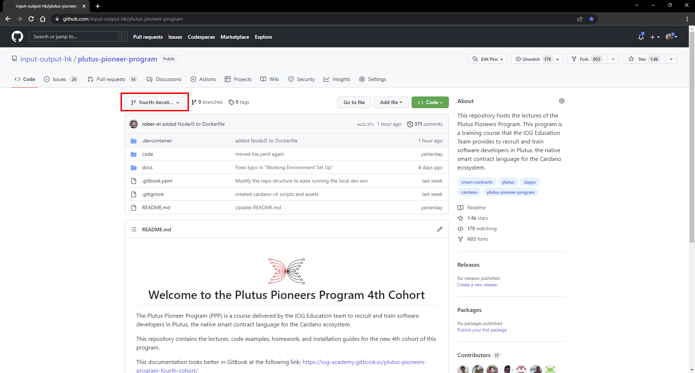
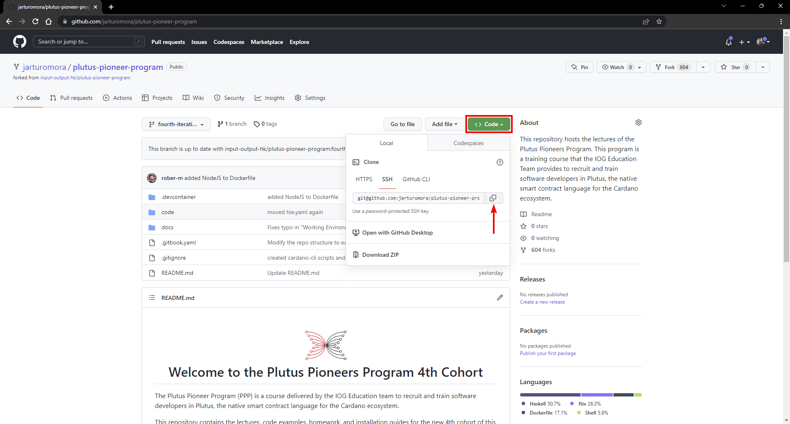
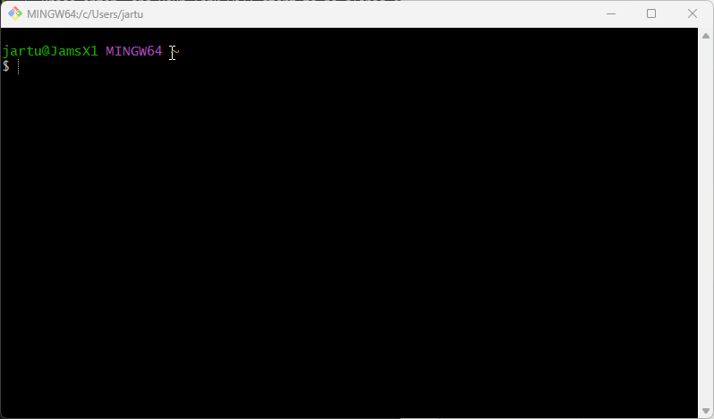
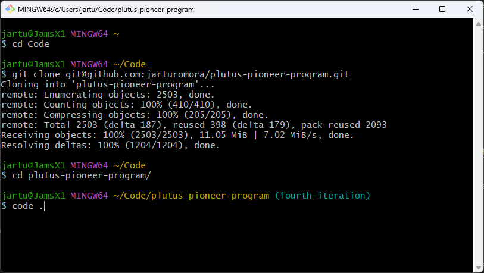
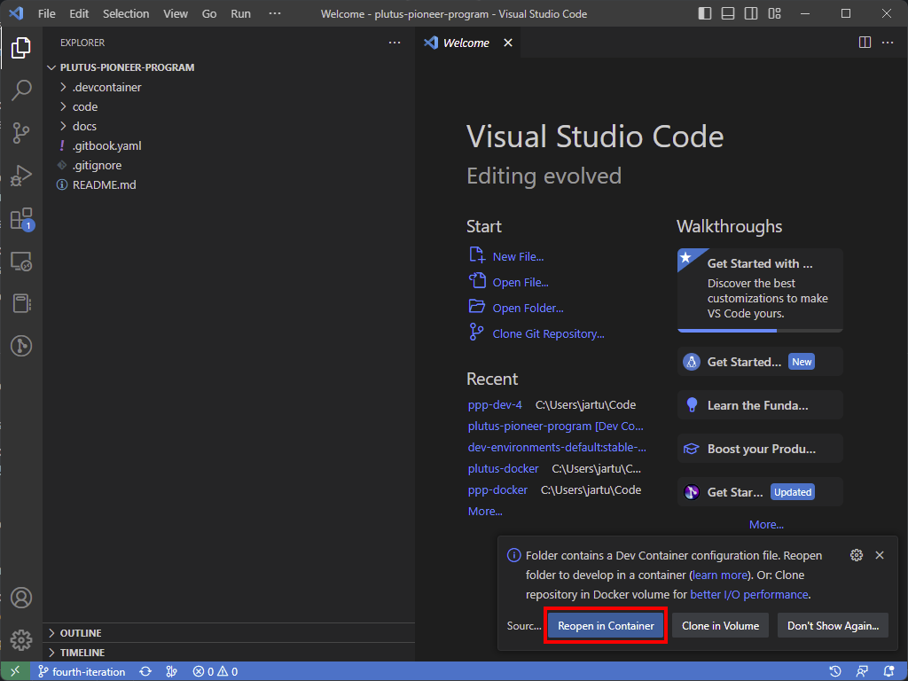
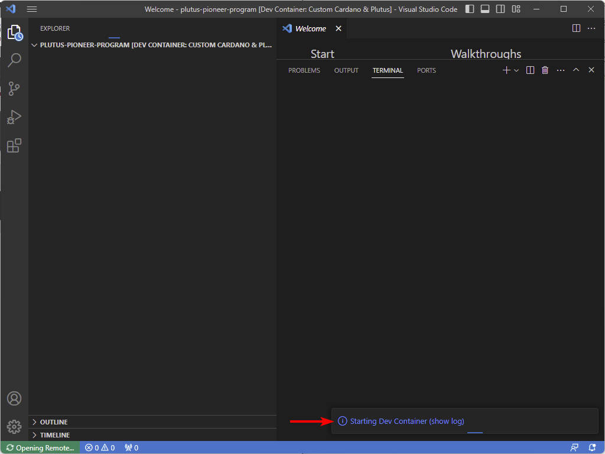
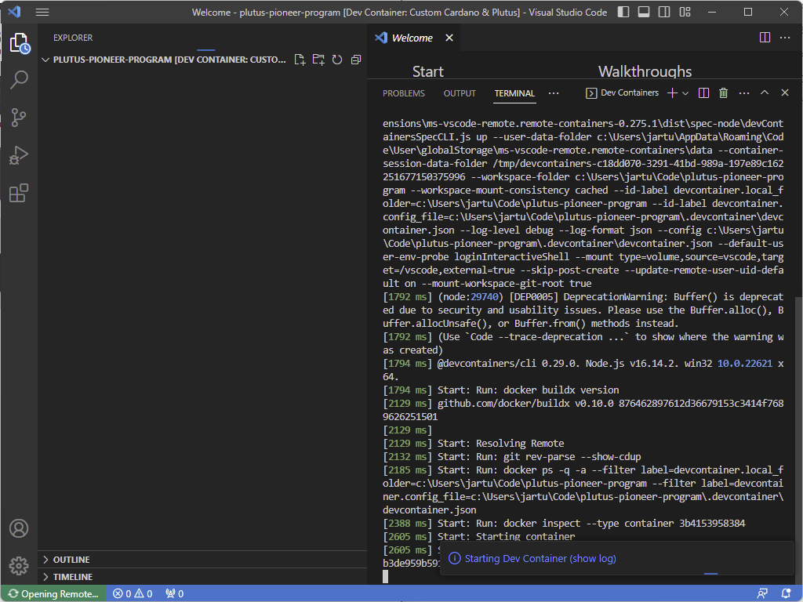
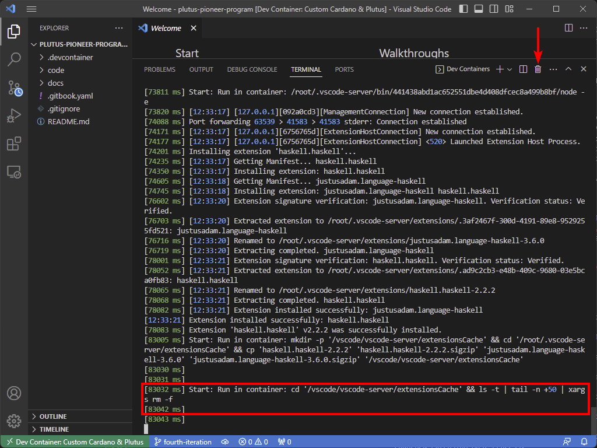
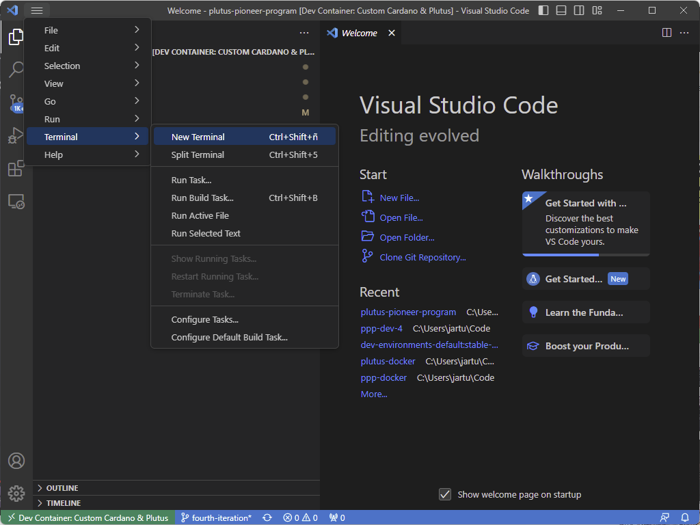
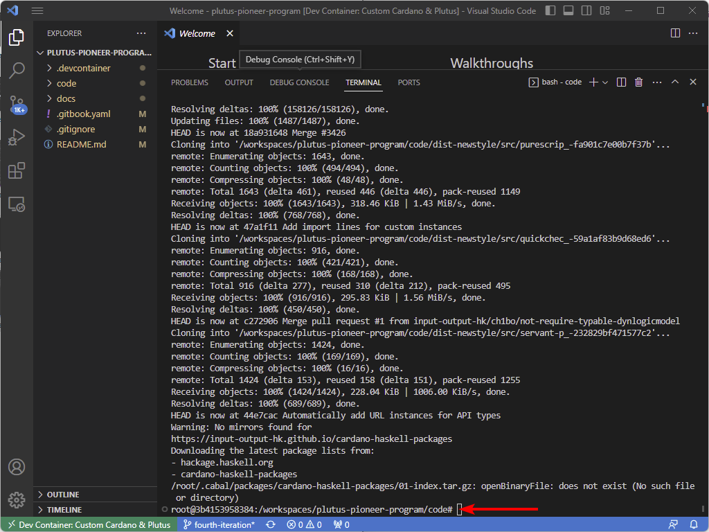

# Using Docker

In this guide, you'll learn how to set up a local working environment using Docker and Visual Studio Code. Whether you have previous experience using Docker or not, we will guide you step by step, from installing the software you need to test your working environment.

## Installing Docker

[Docker](https://www.docker.com/) is a platform designed to help developers build, share, and run applications in an isolated environment on any operating system. 

To ease setting up a local working environment for this course, the IOG Education Team created a Docker container that packages all the dependencies required to follow up the lessons of this program.


A **Docker container** is a standard unit of software that packages up code and all its dependencies, so an application runs quickly and reliably from one computing environment to another. From the Docker documentation, you can learn more about Docker containers on [this page](https://www.docker.com/resources/what-container/).


Follow the next steps to install Docker in your computer.

1. Open your browser and navigate to <https://www.docker.com/>. Click the "Download Docker Desktop" button from the Docker's homepage. By default, you'll download a version compatible with your operating system. Docker is available for Linux, Microsoft Windows, and Apple macOS.

    The image below shows how the download button looks on a computer using Microsoft Windows. We'll use this operating system for this guide.

    


**Important note for macOS users.** Be sure that you download the correct version according to the chip of your computer, for M1 or M2 chips, [download the "Apple Chip" version](https://desktop.docker.com/mac/main/arm64/Docker.dmg). For Intel chips, [download the "Intel Chip" version](https://desktop.docker.com/mac/main/amd64/Docker.dmg).


2. After downloading the Docker Desktop installer, execute it and follow the instructions by choosing the default options. Installation options may vary depending on your chip and operating system. If you need detailed instructions, please visit the [Get Docker section](https://docs.docker.com/get-docker/) on the docker docs website.

    
    After installing Docker Desktop, it'll automatically start after login into your computer. You can change this behavior by turning off the "Start Docker Desktop when you log in" in the Docker Settings configuration. The following image shows the general settings in Docker Desktop running on Windows.

    

    To learn more about changing the settings in Docker Desktop, please visit the ["Change Settings" section](https://docs.docker.com/desktop/settings/mac/) of the Docker Desktop manual.
    

Now that you have Docker Desktop up and running let's download and install Visual Studio Code.

## Installing Visual Studio Code

[Visual Studio Code](https://code.visualstudio.com/), also known as VS Code, is a source code editor freely distributed by Microsoft that runs on Windows, Linux, and macOS. Additionally, to allow code editing, VS Code allows developers to create and install extensions that ease their daily work.

Follow the next steps to install VS Code and a handy extension that you will use in this course.

1. Open your browser and navigate to <https://code.visualstudio.com/> to open the Visual Studio Code website. As the image below shows, there is a button where you 
can download this software. Depending on your operating system, the button's name will change. Be sure to download the latest version.

    
    To download VS Code for any operating system, please visit the [Download Visual Studio Code page](https://code.visualstudio.com/Download) and choose the operating system of your preference.
    

    The button to download VS Code for Windows is highlighted for this demo.

    

2. After downloading the VS Code installer, execute it and follow the instructions by choosing the default options. Installation options may vary depending on your chip and operating system. If you need detailed instructions, please visit the [Setting up Visual Studio Code section](https://code.visualstudio.com/docs/setup/setup-overview) in the VS Code docs website.

3. Once you have installed VS Code, open it to install an extension. Extensions are additional add-ons that extend the VS Code's functionality; Microsoft provides some extensions, but also, plenty of extensions are created by other companies and developers. To install an extension, click on the "Manage" icon in the bottom left corner and choose the "Extensions" options in the image below shows.

    

4. Next, a window showing the "Extensions Marketplace" will appear on the left side of the VS Code UI. In the search box, type `remote development` to look for the [Remote Development extension provided by Microsoft](https://marketplace.visualstudio.com/items?itemName=ms-vscode-remote.vscode-remote-extensionpack). Once the extension appears, click on it. As the image below shows, you should click on the "Install" button to install an extension.

    

5. After successfully installing the Remove Development extension, you'll note that an "Uninstall" button appears in the extension description tab, and the "Open a Remote Window" icon will appear on the bottom left corner of the VS Code UI as you can see in the following image.

    

Awesome, you have installed all the required software to use the Docker container! Now, we'll guide you through the steps you must follow to load the Docker container and execute it for the first time.

## Running the PPP Docker Container

Before moving forward into using the Docker container provided for this cohort of the PPP, you need to close VS Code. Next, please follow the next section, where we'll guide you on finishing the setup of your local working environment.

### Forking the PPP Repository

In this section, we'll guide you to fork the repository for the Plutus Pioneers Program in GitHub. A fork is a new repository that shares code and visibility settings with the original repository. It's like having a personal copy of the original repo hosted in your GitHub account. You can learn more about forks in the [Fork a repo section](https://docs.github.com/en/get-started/quickstart/fork-a-repo) at GitHub Docs.


**Note that you need a GitHub account to fork the repository.** If you don't have a GitHub account, please follow [this link](https://github.com/join) to create one. If you need further assistance in creating a GitHub account, please read the [Signing up for GitHub section](https://docs.github.com/en/get-started/signing-up-for-github) at GitHub Docs.


Follow the next steps to fork the PPP repository.

1. Open your browser, navigate to <https://github.com/>, and login into your GitHub account.

2. After login into GitHub, open the PPP repository by opening this URL: <https://github.com/input-output-hk/plutus-pioneer-program>. As this guide works for the 4th. Cohort of the PPP, ensure the branch `fourth-iteration` is selected, as you can see in the image below.

    

    You are free to navigate through the branches of previous cohorts, but please, be aware of using the correct branch for the 4th. Cohort.
    
    
    A **branch** is an isolated version of the main repository. Usually, branches are used to work on particular projects within a git repository. You can learn more about managing branches in GitHub in the [About branches page](https://docs.github.com/en/pull-requests/collaborating-with-pull-requests/proposing-changes-to-your-work-with-pull-requests/about-branches) at GitHub Docs.
    

3. To fork the repository, click the "Fork" icon in the upper right corner, as seen in the image below.

    

4. You will see the "Create a new fork" page next. Be sure to select an owner and set a repository name. By default, if you only have one GitHub account, you will see your username in the "Owner" option. You can leave the "Repository name" box as is. If you only want to fork the branch of the 4th. Cohort, be sure to check the box next to the "Copy the `fourth-iteration` branch only" option. Finally, click on the "Create fork" button to continue. You can see an example of these options in the image below.

    

5. Now, the PPP repo will be forked into your GitHub account. You will see a page similar to the one in the image below. The process may take a few seconds.

    

6. After a few seconds, you'll see your fork. To corroborate that you're using your fork, note that your user name appears in the repository's name in the upper left corner. For example, in the image below, a fork was created by the user `jarturomora`.

    

Now that you forked the repo let's clone it into your computer.

### Cloning your Fork

As for now, your fork of the PPP repository will be your development repository. Using your fork, you can work on the homework assignment and share your progress by pushing updates to your fork. In this section, we'll guide you through the process of cloning your fork in your computer.


To clone your fork into your computer, you need to have Git installed. If you don't have Git installed, please follow [these instructions from the Git documentation](https://git-scm.com/book/en/v2/Getting-Started-Installing-Git), where you'll find detailed information about installing Git on Linux, macOS, and Windows.


Please follow the next steps to clone your PPP fork.

1. Ensure that your PPP fork is open in your browser on the GitHub website. Next, as you can see in the image below, click on the "Code" green button to open the clone options and continue by clicking on the "Copy" icon next to the repository path to copy that path to the clipboard.

    

2. Open a terminal window (we recommend using [Git BASH](https://gitforwindows.org/#bash) in Windows) and navigate to a directory where you want to save the PPP fork clone. Next, type `git clone ` and paste the path you copied from your fork at GitHub to build the following command.

    ```bash
    git clone git@github.com:jarturomora/plutus-pioneer-program.git
    ```

3. Press enter, and your fork will start to be cloned at your computer, as you can see in the animation below.

    

    The previous animation shows a terminal window where the user types `cd Code` to move to a local directory called `Code`. Next, the user types `git clone ` followed by copying the path of the GitHub fork that the user wants to clone. Once the command is complete, the user hits the enter key, and the fork is cloned.

Now that you cloned your fork into your computer, it's time to open the Docker container using VS Code.

### Opening the PPP Docker Container in Visual Studio Code

Before moving forward, please close VS Code if it's open, as it needs to restart to allow the "Remote Development" extension to detect the Docker file in the repo.

Please follow the next steps to open and configure your PPP Docker container.

1. Open a terminal window, navigate to the directory where you clone your PPP fork, and type `code .` to open Visual Studio Code inside the repository's directory. The following image shows an example of this command's appearance in a Git BASH terminal.

    

2. When VS Code opens, the "Remote Development" extension will detect the Docker container. As shown in the image below, you'll see a message asking to reopen your project in the container. Click on the "Reopen in Container" button to continue.

    

3. After reopening your project in Container, the Docker container will be built. As you can see in the image below, you can click on the "Starting Dev Container" message to view the log. Please show the log to be aware of when the container is ready.

    

    The following image shows how the log looks after you open it.

    

4. After a few minutes, you will see a message in the log starting with the text `Start: Run in container` as you can see in the image below. This message indicates that the dev container is ready. You can safely close this terminal window by clicking on the trash can icon in the upper right corner of the terminal window.

    

5. Now, open a new terminal window into VS Code by clicking on the "Terminal" menu, as shown in the image below.

    

6. From the new terminal window, type and execute the command `cd code` to enter into the _code_ directory of the repository. **This step is critical** as all the code and updates should run into the _code_ directory. Next, after switching to the _code_ directory, type and execute the command `cabal update` to update all the dependencies required by Plutus.

    
    **Be patient while running these commands.** Depending on your hardware configuration and an internet connection, the time required to execute the command `cabal update` may vary. It takes at least 5 minutes to finish; however, we experienced waiting times of up to 15 minutes in some hardware and internet settings.
    

    The following image shows a sample execution of these commands.

    

    Once the `cabal update` command execution ends, you will see the terminal prompt waiting to move forward, as seen in the image below.

    

7. Now, to finish the dev container setup, type and execute the command `cabal build all` in the VS Code terminal, as the image below shows.

    

    
    **Be patient while running this command.** The time required to execute this command may vary depending on your hardware configuration and internet connection. It can take at least 10 minutes to finish. However, we experienced waiting times of up to 25 in some hardware and internet settings.
    

## Troubleshooting Guide

We hope you set up your local working environment smoothly! However, we know problems may happen, so please follow this guide in case you find any issues during the installation process.

### Linux Issues

* If while opening the Docker container in VS Code, you get an error message that says `View container 'remote' requires 'enabledApiProposals: ["contribViewsRemote"]' to be added to 'Remote'.` You may uninstall VS Code and install the Insiders version. You can download this version [from this page](https://code.visualstudio.com/insiders/). To learn more about why this issue may happen, please read the [Using Proposed API article](https://code.visualstudio.com/api/advanced-topics/using-proposed-api) from the Visual Studio Code documentation.

### Windows Issues

* If you have installed Docker Desktop before joining the PPP, you may receive an error message asking to install the latest WSL version. An example of the error message is shown in the image below. Please refer to [this page from the Windows Subsystem for Linux Documentation](https://docs.microsoft.com/windows/wsl/wsl2-kernel) for further instructions.

  

---

This work is licensed under a [Creative Commons Attribution 4.0 International License](http://creativecommons.org/licenses/by/4.0/).

<figure></figure>