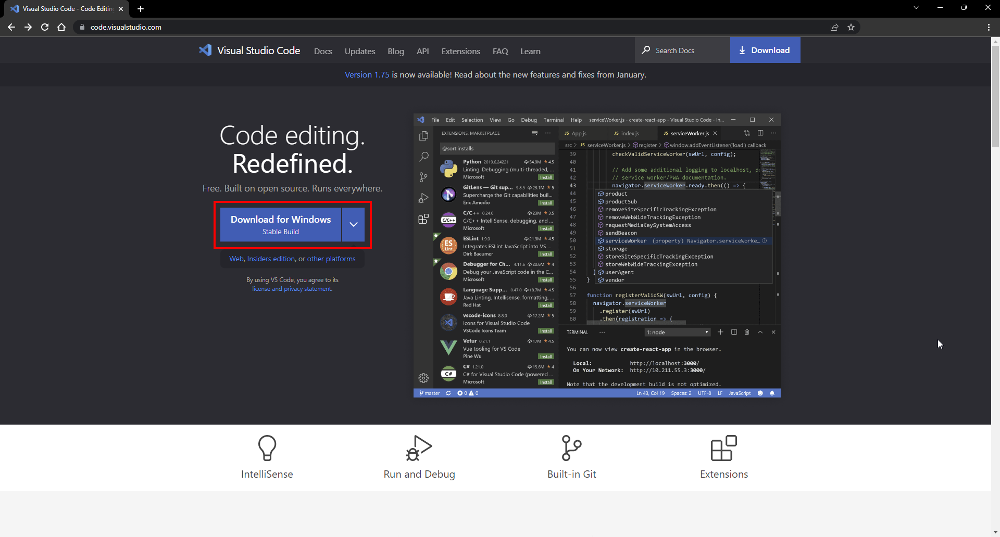
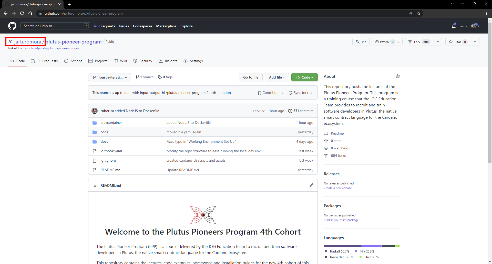

# Using Docker

In this guide, you'll learn how to set up a local working environment using Docker and Visual Studio Code. Either if have previous experience using Docker or not, we will guide you step by step from installing the software you need, through testing your working environment.

## Installing Docker

[Docker](https://www.docker.com/) is a platform designed to help developers build, share, and run applications into an isolated environment on any operating system. 

To ease setting up a local working environment for this course, the IOG Education Team created a Docker container that packages all the dependencies required to follow up the lessons of this program


A **Docker container** is a standard unit of software that packages up code and all its dependencies so and application runs quickly and reliably from one computing environment to another. You can learn more about Docker containers in [this page](https://www.docker.com/resources/what-container/) from the Docekr documentation.


Follow the next steps to install Docker in your computer.

1. Open your browser and navigate to <https://www.docker.com/>. From the Docker's homepage, click on the "Download Docker Desktop" button. By default, you'll download a version compatible with you operating system. Docker is available for Linux, Microsoft Windows, and Apple macOS.

    
    **Important note for macOS users.** Be sure that you download the correct version according to the chip of your computer, for M1 or M2 chips, [download the "Apple Chip" version](https://desktop.docker.com/mac/main/arm64/Docker.dmg). For Intel chips, [download the "Intel Chip" version](https://desktop.docker.com/mac/main/amd64/Docker.dmg).
    

    In the image below, you can see how the download button looks on a computer using Microsoft Windows. We'll this operating system for the purposes of this guide.

    

2. After downloading the Docker Desktop installer, execute it and follow the instructions by choosing the default options. Installation options may vary depending on your chip and operating system. If you need detailed instructions, please visit the [Get Docker section](https://docs.docker.com/get-docker/) in the docker docs website.

    
    After installing Docker Desktop, it'll automatically start after login into your computer. You can change this behavior by turning off the "Start Docker Desktop when you log in" in the Docker Settings configuration. The following image shows the general settings in Docker Desktop running in Windows.

    

    To learn more about changing the settings in Docker Desktop, please visit the ["Change Settings" section](https://docs.docker.com/desktop/settings/mac/) of the Docker Desktop manual.
    

Now that you have Docker Desktop up and running, let's download and install Visual Studio Code.

## Installing Visual Studio Code

[Visual Studio Code](https://code.visualstudio.com/), also known as VS Code, is a source code editor freely distributed by Microsoft that runs on Windows, Linux and macOS. Additionally to allow code editing, VS Code allows developers to create and install extensions that eases their daily work.

Follow the next steps to install VS Code and a handy extension that you will use in this course.

1. Open your browser and navigate to <https://code.visualstudio.com/> to open Visual Studio Code website. As the image below shows, there is a button where you 
can download this software. Depending on your operating system, the button's name will change. Be sure to download the latest version.

    
    To download VS Code for any operating system, please visit the [Download Visual Studio Code page](https://code.visualstudio.com/Download) and choose the operating system of your preference.
    

    For this demo, the button to download VS Code for Windows is highlighted.

    

2. After downloading the VS Code installer, execute it and follow the instructions by choosing the default options. Installation options may vary depending on your chip and operating system. If you need detailed instructions, please visit the [Setting up Visual Studio Code section](https://code.visualstudio.com/docs/setup/setup-overview) in the VS Code docs website.

3. Once you installed VS Code, open it to install a extension. Extensions are additional add-ons that extends the VS Code's functionality; some extensions are provided by Microsoft, but also, there are plenty of extensions created by other companies and developers. To install a extension, click on the "Manage" icon in the bottom left corner and choose the "Extensions" options at the image below shows.

    

4. Next, a window showing the "Extensions Marketplace" will appear on the left side of the VS Code UI. In the search box type `remote development` to look for the [Remote Development extension provided by Microsoft](https://marketplace.visualstudio.com/items?itemName=ms-vscode-remote.vscode-remote-extensionpack). Once the extension appears, click on it. As the image below shows, to install a extension you should click on the "Install" button.

    

5. After successfully installing the Remove Development extension, you'll note that a "Uninstall" button appears in the extension description tab, and the "Open a Remote Window" icon will appear on the bottom left corner of the VS Code UI as you can see in the following image.

    

Awesome, you have installed all the required software to use the Docker container! Now, we'll guide you through the steps you need to follow to load the Docker container and execute it for the first time.

## Running the PPP Docker Container

Before moving forward into using the Docker container provided for this cohort of the PPP, you need to close VS Code. Next, please follow the next section where we'll guide you on finishing the set up of you local working environment.

### Forking the PPP Repository

In this section, we'll guide to fork the repository for the Plutus Pioneers Program in GitHub. A fork is a new repository that shares code and visibility settings with the original repository. It's like having a personal copy of the original repo hosted in your GitHub account. You can learn more about forks in the [Fork a repo section](https://docs.github.com/en/get-started/quickstart/fork-a-repo) at GitHub Docs.


**Note that you need a GitHub account to fork the repository.** If you don't have a GitHub account, please follow [this link](https://github.com/join) to create it. If you need further assistance to create a GitHub account, please read the [Signing up for GitHub section](https://docs.github.com/en/get-started/signing-up-for-github) at GitHub Docs.


Follow the next steps to fork the PPP repository.

1. Open your browser, navigate to <https://github.com/> and login into your GitHub account.

2. After login into GitHub, open the PPP repository by opening this URL: <https://github.com/input-output-hk/plutus-pioneer-program>. As this guide works for the 4th. cohort of the PPP, be sure that the branch `fourth-iteration` is selected as you can see in the image below.

    

    You are free to navigate through the branches of previous cohorts, but please, be aware of using the correct branch for the 4th. cohort.
    
    
    A **branch** is an isolated version of the main repository. Usually, branches are used to work in particular projects within a git repository. You can learn more about managing branches in GitHub in the [About branches page](https://docs.github.com/en/pull-requests/collaborating-with-pull-requests/proposing-changes-to-your-work-with-pull-requests/about-branches) at GitHub Docs.
    

3. To fork the repository, click on the "Fork" icon in the upper right corner as you can see in the image below.

    

4. Next, you will see the "Create a new fork" page. Be sure to select an owner and set a repository name. By default, if you only have one GitHub account, you will see your username as in the "Owner" option. You can leave the "Repository name" box as is. If you only want to fork the branch of the 4th. cohort, be sure to check the box next to the "Copy the `fourth-iteration` branch only" option. Finally, click on the "Create fork" button to continue. You can see an example of these options in the image below.

    

5. Now, the PPP repo will be forked into your GitHub account. You will see a page similar to the one in the image below. The process may take a few seconds.

    

6. After a few seconds, you'll see your fork. To corroborate that you're using your fork, note that your user name appears in the repository's name in the upper left corner. In the image below, a fork was created i by the user `jarturomora`.

    

Now that you forked the repo, let's clone it into your computer.

### Cloning you Fork